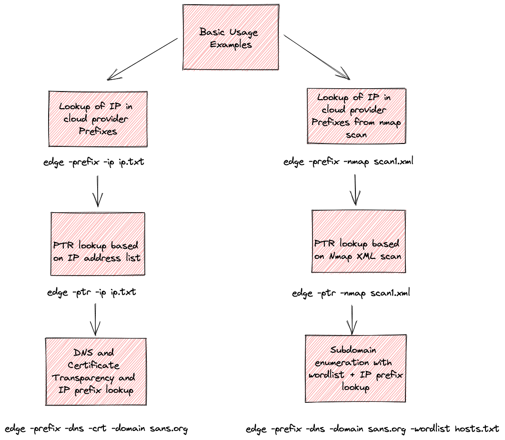

# Cloud edge tool
Cloud edge is a recon tool focused on exploring cloud service providers.  Can be used for pentesting, bug bounty, red teaming, or general R&D of cloud providers.  Edge automatically loads CSP IP prefixes (AWS, Azure, GCP) and can do prefix lookups based on IP addressing.  In a black box network pentest, this is a great tool to quickly discover which cloud CSP the customer is hosted with, or just double-verifying the scope for rules of engagment.  Each of the three Cloud Service Proviers (Amazon, Azure, GCP) publish a list of all of their IP prefixes and/or netblocks.  In some cases this also includes the region/data center and service name.  This can be useful for recon and this tool can quickly parse and do a lookup based on IP prefix.



# Demo Video
Coming soon.


# Options
```
$ edge -help
Usage of edge:
  -crt
    	Certificate transparency lookup mode
  -csv string
    	Output results to CSV file
  -dns
    	A and CNAME record lookup mode
  -domain string
    	The domain to perform guessing against.
  -ip string
    	The text file to use with IP addresses
  -nmap string
    	Nmap scan xml file to use.
  -output
    	Enable output to CSV
  -prefix
    	IP Prefix CSP lookup mode
  -ptr
    	PTR lookup mode
  -resolver string
    	The DNS server to use. (default "8.8.8.8:53")
  -verbose
    	Enable verbose output
  -wordlist string
    	The wordlist to use for guessing.
  -workers int
    	The amount of workers to use. (default 10)
```

# Examples
* **```$ edge -domain <domain> -dns -crt -prefix -wordlist <wordlist.txt>```**

**Description:**  Perform a wordlist scan of all A and CNAME records based on wordlist.txt against domain with certificate transparency lookup.  For each enumerated host found with Cert transparency, also do a DNS lookup.  Do an IP prefix lookup of the IP address across all three cloud service provider's published list of IP prefixes.

* **```$ edge -domain <domain> -dns -wordlist <wordlist.txt>```**  

**Description:** Perform just a wordlist scan of all A and CNAME records based on wordlist.

* **```$ edge -domain <domain> -dns -wordlist <wordlist.txt> -prefix```**  

**Description:** Perform just a wordlist scan of all A and CNAME records based on wordlist.  For every IP address enumerated, perform a prefix lookup.

* **```$ edge -domain <domain> -crt```**  

**Description:** Do a Certificate Transparency log lookup using https://crt.sh


* **```$ edge -domain <domain> -dns -crt```**

**Description:** Perform a Certificate transparency lookup.  For each host discovered via Cert Transparency, do a full DNS A or CNAME lookup.

* **```$ edge -prefix -ip <ip-hosts.txt>```**

**Description:** Perform a lookup of the IP address for the cloud service provider IP prefix.  Takes a list of IP addresses in ip-hosts.txt and looks through it doing a lookup.  One IP address per line.

* **```$ edge -ptr -ip <ip-hosts.txt>```**

**Description:** Does a DNS PTR lookup based on the IP address on each line of ip-hosts.txt.

* **```$ edge -prefix -nmap <results.xml>```**

**Description:** Parses an nmap scan XML file, identifying all "Up" hosts.  For every "Up" host in nmap XML scan results, do an IP prefix lookup for the cloud service provider.


* **```$ edge -ptr -nmap <results.txt>```**

**Description:** Parses an nmap scan XML file, and does a PTR lookup of every "Up" host.


* **```$ edge -domain <domain> -dns -wordlist <wordlist.txt> -workers 100```**

**Description:** Uses a DNS concurrency scan of 100 workers.  This increases the scan speed.  Default workers: 10.

* **```$ edge -domain <domain> -dns -wordlist <wordlist.txt> -resolver 8.8.4.4:53```**

**Description:** Specify a DNS resolver of 8.8.4.4 on port 53.  Default is 8.8.8.8.


* **```$ edge -crt -domain <domain> -output -csv <output.csv>```**

**Description:** Output results to a CSV file, output.csv.


* **```$ edge -crt -domain <domain> -verbose```** 

**Description:** Enable verbose output.


# Building

You can grab the pre-compiled binaries or build it.

Tested with go1.18

```
$ git clone https://github.com/iknowjason/edge.git
$ cd edge
~/edge$ go get -u github.com/miekg/dns
~/edge$ go get -u golang.org/x/net/html
~/edge$ go env -w GO111MODULE=off
~/edge$ go build edge.go
~/edge$ ./edge (Verify it)
```


# Credits
@mosesrenegade for tool inspiration

@0xdabbad00 for general AWS tools and inspiration

This tool was inspired from many other tools and authors, including dnsrecon and gobuster.  Yeah I know.  Not a lot new here - just another subdomain enumeration tool.  I just really wanted to learn Golang :-)

"Black Hat Go" book
